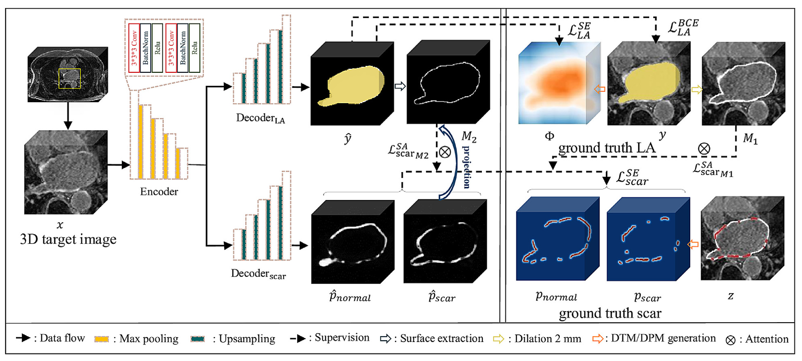
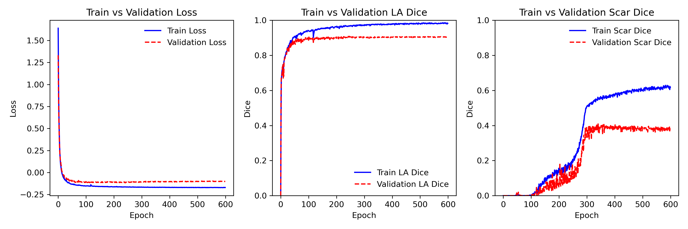
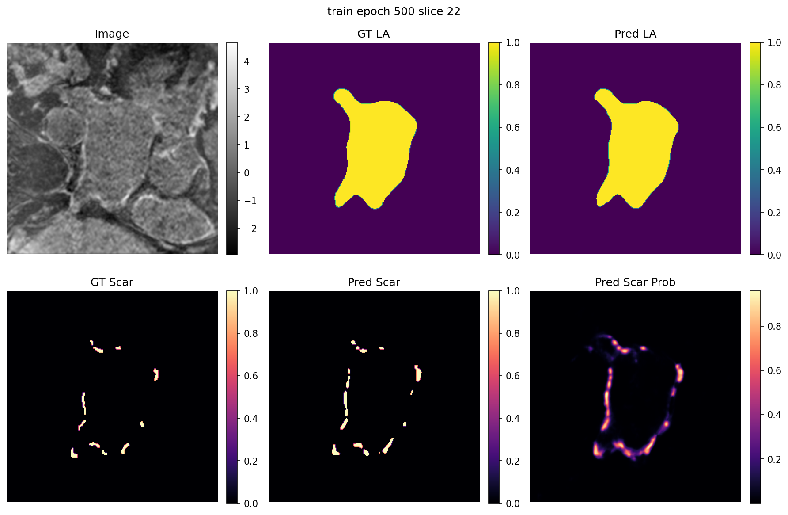
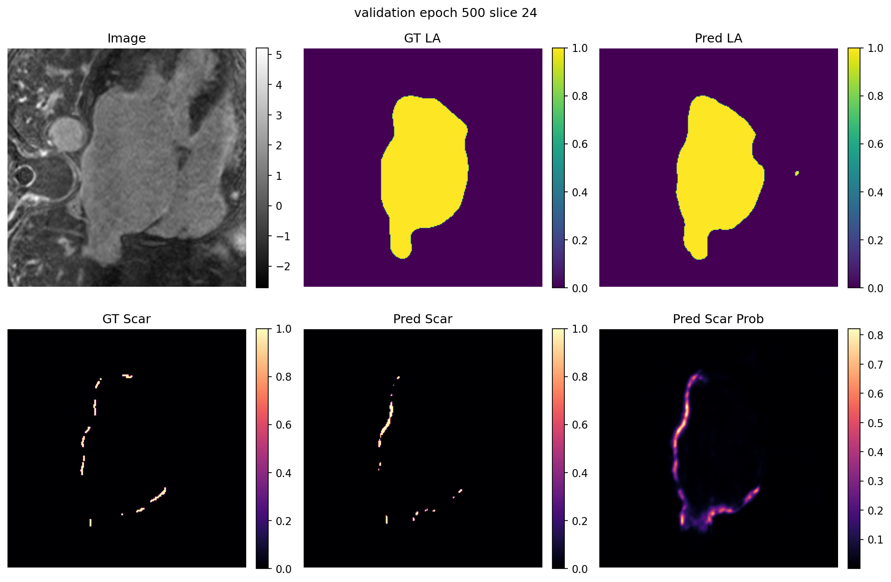
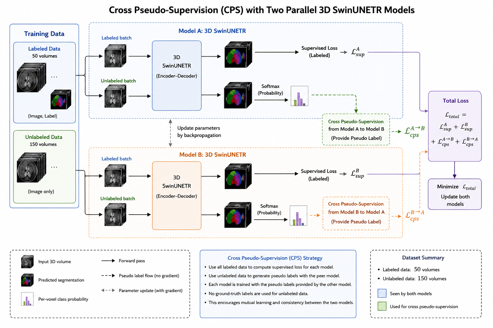
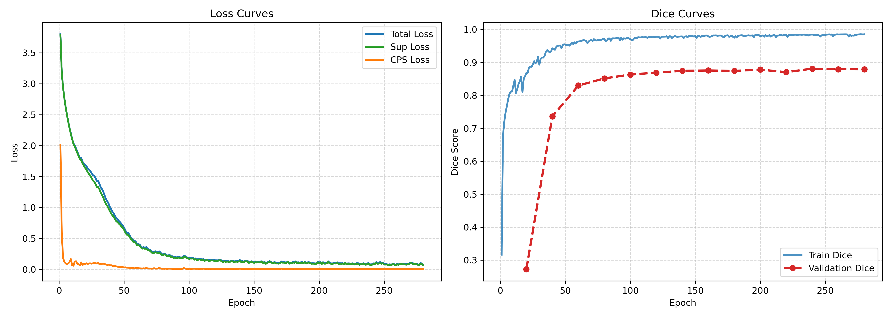
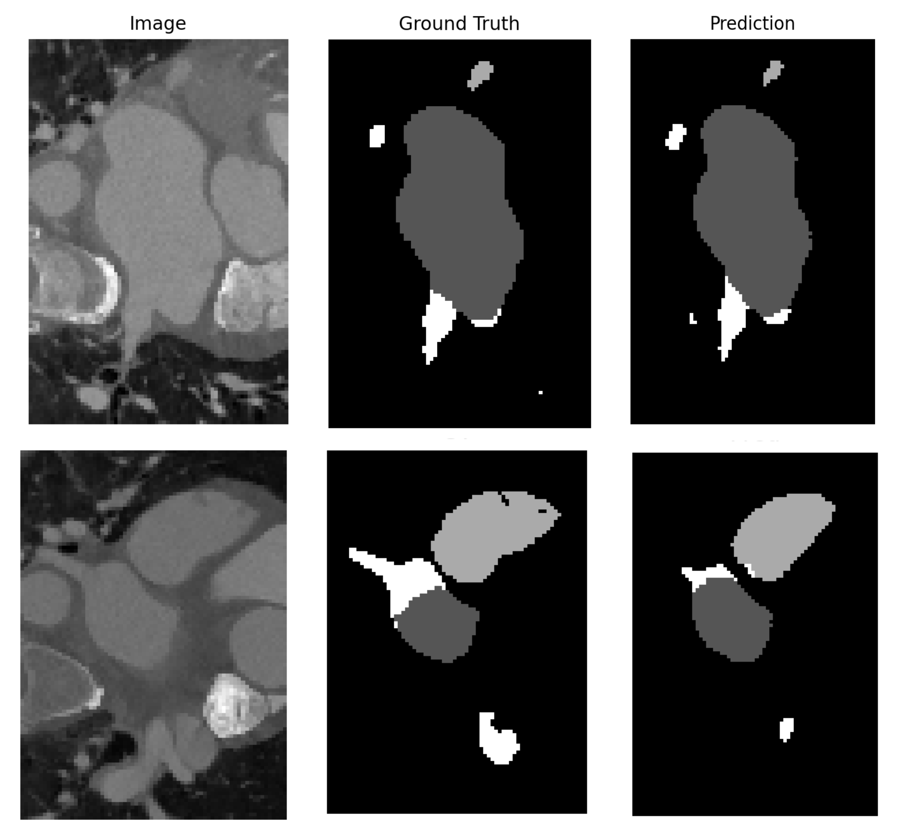

# Left Atrium Segmentation in CT and LGE-MRI

Deep-learning pipelines for left atrium (LA) analysis in 3D medical images. This project addresses two tasks:

1. **Joint LA cavity and atrial scar segmentation from LGE-MRI** using a multi-task 3D U-Net with spatial and shape-aware supervision.
2. **Multi-structure segmentation from CT** using semi-supervised cross pseudo-supervision with two 3D SwinUNETR models.

The project was developed for the CARE challenge as part of BIOS 740.

## Results

| Task | Training Dice | Validation Dice |
| --- | ---: | ---: |
| LA cavity segmentation (MRI) | 0.99 | 0.90 |
| LA scar segmentation (MRI) | 0.60 | 0.40 |
| Multi-structure segmentation (CT) | 0.98 | 0.88 |

> Dice values are reported from the experiments described in the project report. Background is excluded from the mean CT Dice.

## Method overview

### 1. Joint LA cavity and scar segmentation from MRI

A modified 3D U-Net uses a shared encoder and two task-specific decoders to jointly learn LA anatomy and scar appearance. Joint learning is useful because atrial scars are small, highly imbalanced targets that are spatially associated with the LA wall.



*Joint segmentation and scar-quantification framework with spatial encoding and shape attention.*

The MRI pipeline includes:

- a fixed `256 x 256 x 44` crop centered on the LA;
- z-score intensity normalization;
- intensity augmentation during training;
- signed distance transform maps for continuous boundary supervision;
- distance probability maps for smooth scar projection near the atrial surface; and
- shape-attention losses that couple scar prediction with the true and predicted LA boundaries.

The total objective combines LA segmentation, LA spatial encoding, scar regression, and two shape-attention terms:

$$
\mathcal{L} = \mathcal{L}_{LA}
+ \lambda_{scar}\mathcal{L}^{SE}_{scar}
+ \lambda_{M1}\mathcal{L}^{SA}_{scar,M1}
+ \lambda_{M2}\mathcal{L}^{SA}_{scar,M2}.
$$

#### MRI results



*Training and validation loss, LA cavity Dice, and LA scar Dice across epochs.*

| Training example | Validation example |
| --- | --- |
|  |  |

The examples compare the input image, ground-truth LA and scar masks, predicted masks, and continuous scar probability map.

### 2. Semi-supervised multi-structure segmentation from CT

The CT pipeline uses two parallel 3D SwinUNETR networks trained with cross pseudo-supervision (CPS). It learns from 50 labeled CT volumes while also using 150 unlabeled volumes.



*Cross pseudo-supervision framework for combining labeled and unlabeled CT volumes.*

Preprocessing and augmentation include:

- reorientation to RAS;
- resampling to `1.5 x 1.5 x 2.0 mm` spacing;
- intensity normalization;
- foreground cropping and padding;
- `64 x 64 x 64` training patches;
- random flips along all spatial axes; and
- random 90-degree rotations.

For labeled images, both networks use Dice plus cross-entropy loss. For unlabeled images, the networks receive different augmented views and generate pseudo-labels for one another. Only predictions with confidence greater than `0.95` contribute to the CPS loss. Its weight follows a sigmoid ramp-up during the first 30 epochs.

At inference time, the probability outputs of both networks are averaged. Sliding-window inference uses 50% overlap.

#### CT results



*Training losses and mean foreground Dice during the CT experiment.*



*Representative CT slices with ground-truth and predicted multi-structure segmentations.*

## Repository structure

Update this section after adding the code to the repository.

```text
.
├── README.md
├── assets/                   # Architecture diagrams, curves, and examples
├── requirements.txt          # Python dependencies
├── data/                     # Dataset or dataset links (do not commit private data)
├── mri/                      # LA cavity and scar pipeline
│   ├── train.py
│   ├── infer.py
│   ├── models/
│   ├── losses/
│   └── utils/
├── ct/                       # Semi-supervised CT pipeline
│   ├── train.py
│   ├── infer.py
│   ├── models/
│   └── utils/
├── configs/                  # Experiment configurations
└── outputs/                  # Checkpoints, logs, and predictions
```

## Installation

```bash
git clone https://github.com/colaquafina/BIOS740_JushenWu.git
cd BIOS740_JushenWu

python -m venv .venv
source .venv/bin/activate       # Windows: .venv\Scripts\activate
pip install -r requirements.txt
```

The CT pipeline is implemented with [MONAI](https://monai.io/) and PyTorch. Add the tested Python, PyTorch, CUDA, and MONAI versions here once the environment file is finalized.

## Data preparation

The challenge data are not included in this repository. Obtain access through the official challenge provider and follow its terms of use.

Organize the data according to the paths expected by the training scripts. For example:

```text
data/
├── mri/
│   ├── images/
│   ├── la_labels/
│   └── scar_labels/
└── ct/
    ├── images_labeled/
    ├── labels/
    └── images_unlabeled/
```

If your scripts generate train/validation splits automatically, document the split file or random seed. The CT experiments used an 80/20 labeled-data split with seed `42`.

## Training

Replace the example commands below with the final script names and arguments used by the repository.

### MRI: LA cavity and scar

```bash
python mri/train.py --config configs/mri.yaml
```

### CT: semi-supervised multi-structure segmentation

```bash
python ct/train.py --config configs/ct.yaml
```

The reported CT experiment used AdamW, batch size 1, 300 epochs, and validation every 5 epochs.

## Inference

```bash
# MRI
python mri/infer.py --config configs/mri.yaml --checkpoint <path-to-checkpoint>

# CT
python ct/infer.py --config configs/ct.yaml --checkpoint-a <model-a> --checkpoint-b <model-b>
```

Document the output format and post-processing steps here after the inference scripts are added.

## Evaluation

Segmentation performance is evaluated with the Dice similarity coefficient:

$$
\operatorname{Dice}(P,G) = \frac{2|P \cap G|}{|P|+|G|},
$$

where $P$ is the predicted mask and $G$ is the ground-truth mask. CT performance is reported as the mean foreground Dice across the three target structures.

## Limitations

- LA scar segmentation remains challenging because scar occupies a very small fraction of the image and its boundary can be ambiguous.
- The reported scar Dice (`0.40` on validation data) is substantially lower than the LA cavity Dice, leaving room for improved class-imbalance handling, threshold tuning, and stronger validation.
- Results are based on the challenge split described in the report and may not generalize to images from other scanners or institutions without external validation.

## References

1. Li, L., et al. “AtrialJSQnet: A new framework for joint segmentation and quantification of left atrium and scars incorporating spatial and shape information.” *Medical Image Analysis*, 76, 102303, 2022.
2. Cao, H., et al. “Swin-Unet: Unet-like pure transformer for medical image segmentation.” *European Conference on Computer Vision*, 2022.
3. Hatamizadeh, A., et al. “Swin UNETR: Swin Transformers for Semantic Segmentation of Brain Tumors in MRI Images.” *BrainLes 2021*, 2022.

## Author

Jushen Wu  
University of North Carolina at Chapel Hill  
[gsonw@unc.edu](mailto:gsonw@unc.edu)

## License

No license has been selected yet. Add a `LICENSE` file before public reuse or redistribution.
